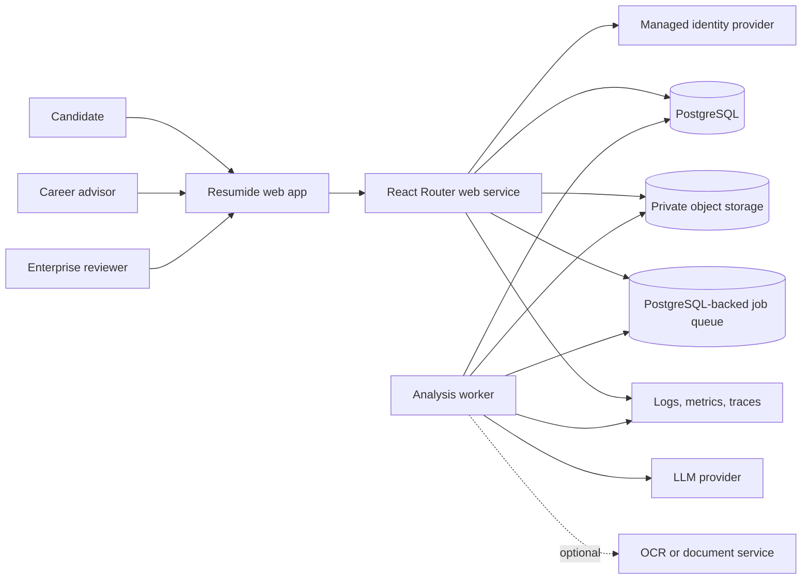
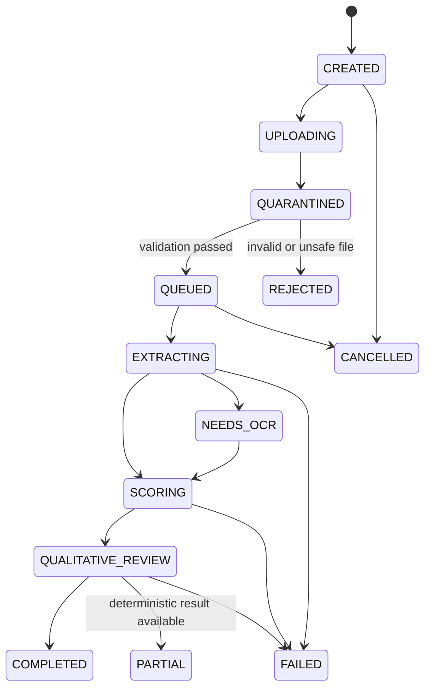

# Resumide Target Architecture

Status: **CANDIDATE B2C FOUNDATION APPROVED; PHASE 7 LOCAL IMPLEMENTATION COMPLETE; GATE A4 OPEN**
Last updated: 2026-09-11
Canonical execution documents: [`tasks/plan.md`](tasks/plan.md) and [`tasks/todo.md`](tasks/todo.md)

This document defines the target architecture for turning the current ResumeATS prototype into a reliable B2C product and, only after explicit gates are passed, an enterprise-capable platform. It is written for humans and implementation agents. Existing code is evidence of the current state, not proof that a capability is complete.

## 1. Product definition

Resumide helps a candidate understand how reliably their resume can be parsed, how closely it matches a job description, and how to improve it without inventing experience. Its core differentiators are:

1. A transparent parse simulation showing what fields and sections were extracted.
2. Versioned, deterministic compatibility checks with a rule trace.
3. A job-description match view that distinguishes found, missing, and uncertain terms.
4. Qualitative writing feedback produced by an LLM under a strict schema.
5. An improvement loop that preserves versions and shows score deltas.

The product is **not** an exact emulator of Workday, Greenhouse, Taleo, or another proprietary ATS. User-facing language must say “ATS compatibility guidance” or “parse simulation,” never claim guaranteed passage through an employer’s ATS.

### Product modes

| Mode                    | Primary user             | Permitted purpose                            | Gate                           |
| ----------------------- | ------------------------ | -------------------------------------------- | ------------------------------ |
| Candidate coach         | Individual job seeker    | Self-improvement and application preparation | Build first                    |
| Career-center workspace | Advisor and candidate    | Human-assisted coaching                      | After B2C reliability gate     |
| Employer workspace      | Recruiter or hiring team | Advisory review with human oversight         | Separate enterprise/legal gate |

Employer ranking, automatic rejection, or fully automated hiring decisions are out of scope until accuracy, fairness, human-oversight, and legal requirements are independently approved.

## 2. Status vocabulary

Every plan, task, PR, and handoff must use these labels:

- `IMPLEMENTED`: code exists in the current branch.
- `VERIFIED`: acceptance criteria passed in the required evidence tier.
- `PARTIAL`: some behavior exists, but acceptance criteria are incomplete.
- `PLANNED`: specified but not implemented.
- `BLOCKED`: cannot continue without a named decision, credential, service, or external action.
- `DEFERRED`: intentionally outside the active phase.

“Build passes” does not mean a page, workflow, security control, deployment, or scoring claim is verified.

## 3. Current-state baseline

The current repository contains a React Router SSR application, an authenticated `/api/analyze` resource action, all-page PDF text extraction through `unpdf`, heuristic parsing, versioned deterministic rules, an OpenAI structured-output pass, durable Supabase-backed analysis/job state, and a browser-side result cache over server-owned results.

### What is currently working

- TypeScript typecheck and production compilation.
- Synthetic extraction, parsing, rule, and non-LLM pipeline self-checks.
- Authenticated, rate-limited, consent-gated durable analysis ingestion with private storage and idempotency.
- Leased analysis and privacy workers with retry, cancellation, retention, export, deletion, and audit boundaries.
- Security headers, same-origin enforcement, bounded sessions, PII-safe telemetry, health/readiness, and protected metrics.
- Unit/integration/browser/accessibility/benchmark/load/restore checks wired into CI.
- Browser and upload rendering at laptop and mobile widths.

### Known release blockers

- Production start requires explicit secret/config injection; it does not load a developer `.env` implicitly.
- Malware scanning, parser sandboxing, restricted worker egress, and container/runtime policy remain deployment-owned controls.
- The checked-in Phase 7 migrations are applied to the configured hosted project and the hosted schema, tenant/RLS, private-storage, and Phase 4 persistence smoke checks pass. The local Supabase database also resets cleanly through the current migration set and passes the SQL verification/lint gates.
- Live OpenAI verification is blocked by the configured model credential returning HTTP 401. Malware scanning, parser sandboxing, restricted worker egress, and container/runtime policy remain deployment-owned controls. Hosted restore, monitored staging E2E, alert notification delivery, rollback rehearsal, privacy-policy approval, and human security/operations approval remain open A4 evidence.
- In-process metrics reset on restart and require a deployment scrape/sink; replacing them with a managed backend is deferred until measured scale requires it.

## 4. Architecture principles

1. **Modular monolith first.** One web deployable and one worker deployable may share domain packages. Do not split into microservices without measured scaling or ownership pressure.
2. **Thin routes, explicit services.** Routes authenticate, validate, authorize, call an application service, and map typed errors to HTTP responses.
3. **Deterministic scoring owns numeric ATS compatibility.** LLM output may explain or critique; it must not silently override deterministic evidence.
4. **All external values are untrusted.** This includes PDFs, job descriptions, model responses, webhooks, environment variables, and stored JSON.
5. **Persist state before navigation.** A result URL must be durable, authorized, refreshable, and return a real 404 when absent.
6. **Version everything affecting a score.** Parser, rules, prompt, schema, model, and normalization versions are recorded with every analysis.
7. **Privacy by minimization.** Store only required data, define retention before collection, and make export/deletion testable.
8. **Accessible and reduced-motion by default.** Animations enhance state changes but never hide meaning or block task completion.
9. **Observable and reversible releases.** No release without health signals, dashboards, a rollback procedure, and an owner.

## 5. Capability map

Stable module IDs must be used in specs, tasks, telemetry, and ownership records.

| Module ID                   | Responsibility                                                               | Depends on                                                    |
| --------------------------- | ---------------------------------------------------------------------------- | ------------------------------------------------------------- |
| `platform-foundation`       | Runtime config, errors, IDs, clocks, CI, deployment contracts                | None                                                          |
| `identity-tenancy`          | Accounts, sessions, organizations, membership, RBAC, SSO boundary            | platform-foundation                                           |
| `resume-ingestion`          | Upload validation, quarantine, storage, extraction, OCR boundary             | platform-foundation, identity-tenancy                         |
| `analysis-orchestration`    | Jobs, leases, idempotency, retries, cancellation, status                     | resume-ingestion                                              |
| `ats-engine`                | Parse simulation, deterministic rules, keyword/skill matching, versioning    | resume-ingestion                                              |
| `qualitative-ai`            | Provider adapter, structured outputs, prompt defense, budget controls        | analysis-orchestration, ats-engine                            |
| `persistence-history`       | Resumes, jobs, analyses, versions, deletion/export                           | identity-tenancy                                              |
| `web-experience`            | Home, upload, progress, result, errors, accessibility, responsive UI         | identity-tenancy, persistence-history, analysis-orchestration |
| `observability-operations`  | Logs, metrics, traces, health, SLOs, alerts, runbooks                        | platform-foundation                                           |
| `privacy-security`          | Consent, retention, encryption, audit, threat model, security controls       | all core modules                                              |
| `billing-entitlements`      | Plans, quotas, metering, invoices, webhook processing                        | identity-tenancy, persistence-history                         |
| `enterprise-administration` | Enterprise workspaces, SSO/SAML, audit export, policy controls, integrations | identity-tenancy, privacy-security, billing-entitlements      |

Build order:

`platform-foundation` → `identity-tenancy` + `persistence-history` → `resume-ingestion` → `analysis-orchestration` → `ats-engine` + `qualitative-ai` → `web-experience` → `privacy-security` + `observability-operations` → `billing-entitlements` → `enterprise-administration`.

Security, privacy, testing, and observability are threaded through every slice even though they have named modules.

## 6. Target system context



### Deployable units

1. **Web service**: SSR pages, authenticated API/resource routes, upload initiation, result reads, user actions, health/readiness.
2. **Analysis worker**: claims jobs, extracts and normalizes documents, runs deterministic scoring, calls the LLM adapter, persists results.
3. **Managed data services**: PostgreSQL, private object storage, identity provider, secret manager, telemetry backend.

The web and worker share TypeScript domain packages and schemas. They are separate processes so long PDF/AI work never holds an HTTP request open.

## 7. Repository target structure

```text
app/
  components/              # Presentation components
  routes/                  # Thin route loaders/actions/pages
  features/
    auth/                   # Session and account UI
    resumes/                # Upload, list, detail UI and client contracts
    analyses/               # Progress/result UI and client contracts
  lib/
    server/
      config/               # Validated runtime configuration
      auth/                 # Session and authorization adapters
      db/                   # Database client and repositories
      storage/              # Private object-storage adapter
      jobs/                 # Job queue and worker lease logic
      analysis/             # Orchestration service
      ats/                  # Parser, rule engine, scoring versions
      ai/                   # Provider interface and OpenAI adapter
      observability/        # Logger, metrics, traces
    shared/                 # Cross-runtime schemas and error codes
db/
  migrations/               # Forward migrations and tested rollback notes
tests/
  unit/
  integration/
  fixtures/                 # Synthetic/anonymized PDFs and expected results
e2e/                        # Browser workflows
docs/decisions/             # ADRs
tasks/                      # Canonical plan and task state
```

Feature-specific logic must not be moved into generic utilities. Git, database, storage, AI, and authentication calls stay behind explicit server adapters.

## 8. Data architecture

All tables use server-generated UUIDs, `created_at`, `updated_at`, and explicit tenant/user ownership. Sensitive records use least-privilege access and audit trails.

| Entity             | Required fields                                                        | Notes                                                                |
| ------------------ | ---------------------------------------------------------------------- | -------------------------------------------------------------------- |
| `users`            | `id`, provider subject, email, status                                  | Identity profile, not password storage                               |
| `organizations`    | `id`, name, type, settings                                             | Personal workspace can be a single-user organization                 |
| `memberships`      | `organization_id`, `user_id`, role                                     | Unique pair; roles enforced server-side and with RLS where available |
| `jobs`             | `id`, organization_id, title, company, description, owner_id           | Job-description source for analyses                                  |
| `resumes`          | `id`, organization_id, owner_id, display_name, status                  | Logical resume independent of file versions                          |
| `resume_versions`  | `id`, resume_id, storage_key, checksum, bytes, media_type, page_count  | Immutable input version                                              |
| `analyses`         | `id`, resume_version_id, job_id, status, requested_by, idempotency_key | Durable user-visible analysis record                                 |
| `analysis_runs`    | versions, model, prompt hash, timestamps, usage, error code            | One execution attempt; immutable evidence                            |
| `analysis_results` | feedback JSON, parse JSON, rule trace JSON, confidence metadata        | Validated against a versioned schema                                 |
| `consents`         | user_id, purpose, policy_version, captured_at                          | Required before third-party AI processing                            |
| `audit_events`     | actor, tenant, action, target, outcome, request_id, timestamp          | Append-only; never store resume body or API keys                     |
| `entitlements`     | organization_id, plan, limits, period                                  | Server-side enforcement source                                       |
| `usage_events`     | organization_id, analysis_id, tokens, cost units                       | Idempotent and reconcilable                                          |

### Invariants

- A user may read a resume only through an active membership in its organization and an allowed role.
- Storage keys are generated by the server and never accepted directly from clients.
- Resume files are private; access uses short-lived signed URLs or authenticated streaming.
- Completed results are immutable. Re-analysis creates a new analysis record.
- Delete requests remove active records and enqueue object, cache, index, and backup-retention actions.
- Every score stores `parser_version`, `ruleset_version`, `normalizer_version`, `prompt_version`, `schema_version`, and `model_id`.

## 9. Analysis lifecycle



Rules:

- State changes use transactions and compare-and-set semantics.
- Workers claim jobs with a lease and heartbeat; abandoned leases can be retried.
- Idempotency prevents duplicate uploads, jobs, AI calls, results, and billing events.
- Retry only transient failures with capped exponential backoff and jitter.
- Deterministic results may be returned as `PARTIAL` when the LLM provider is unavailable.
- Permanent errors use stable public codes; internal stack/provider details stay in protected logs.

## 10. API and route contracts

All JSON errors use:

```json
{
  "error": {
    "code": "UPLOAD_TOO_LARGE",
    "message": "The PDF exceeds the allowed size.",
    "requestId": "req_...",
    "retryable": false
  }
}
```

Target routes:

| Method and route                 | Purpose                     | Success | Required controls                               |
| -------------------------------- | --------------------------- | ------- | ----------------------------------------------- |
| `GET /`                          | Resume/job dashboard        | 200     | Session, tenant-scoped pagination               |
| `GET /upload`                    | Upload form                 | 200     | Session and consent state                       |
| `POST /api/resumes`              | Initiate validated upload   | 201     | Auth, quota, CSRF/origin, body cap, idempotency |
| `POST /api/resumes/:id/complete` | Finalize direct upload      | 202     | Ownership, checksum, quarantine enqueue         |
| `GET /api/analyses/:id`          | Status/result envelope      | 200/404 | Ownership, no cross-tenant leakage              |
| `POST /api/analyses/:id/cancel`  | Cancel queued work          | 202/409 | Ownership, idempotency                          |
| `GET /resume/:id`                | Durable result page         | 200/404 | Server loader and ownership                     |
| `POST /api/resumes/:id/delete`   | Begin privacy-safe deletion | 202     | Re-auth for sensitive action, audit             |
| `GET /api/me/export`             | User data export            | 202     | Re-auth, audited asynchronous export            |
| `GET /healthz`                   | Process liveness            | 200     | No dependency or secret data                    |
| `GET /readyz`                    | Dependency readiness        | 200/503 | Bounded DB/storage/queue checks                 |

The first implementation may upload through the web service for simplicity. Direct-to-object-storage uploads become necessary only when measured file volume justifies them.

## 11. Scoring architecture

### Deterministic layer

The ATS engine owns parsing and numeric compatibility signals. It must:

- Normalize Unicode and whitespace without destroying evidence.
- Detect scanned/image-only PDFs and route them to OCR or return a clear limitation.
- Extract every page and record per-page warnings.
- Support international contact formats and configurable locale behavior.
- Detect common section aliases, columns, tables, headers/footers, reading-order anomalies, dates, bullets, and links.
- Extract multi-word skills and phrases using a versioned taxonomy plus exact evidence spans.
- Exclude skipped rules from the denominator; never award free points for missing inputs.
- Return confidence and “not evaluated” separately from pass/fail.
- Clamp scores and validate the complete result schema before persistence.

### Qualitative AI layer

- The provider adapter accepts a typed request and returns a typed result.
- Resume/JD content is untrusted data and is clearly separated from system instructions.
- Structured output is validated again at the service boundary.
- Calls have input/output token caps, timeouts, retry classification, usage capture, and per-tenant budgets.
- No secret, cross-tenant context, or unnecessary PII enters the prompt.
- Provider refusal or outage yields a partial deterministic result rather than destroying the analysis.
- A provider change requires an evaluation run and a versioned rollout.

### Accuracy evidence

Maintain an anonymized fixture corpus covering clean, multi-page, two-column, scanned, malformed, encrypted, international, sparse, long, and adversarial documents. Define expected fields and rule outcomes. Track field precision/recall, section-detection F1, keyword-match quality, run-to-run variance, failure rate, latency, and cost.

## 12. Page and interaction architecture

| Page                     | Current problem                                                    | Target behavior                                                                                 | Verification                                                                                                                         |
| ------------------------ | ------------------------------------------------------------------ | ----------------------------------------------------------------------------------------------- | ------------------------------------------------------------------------------------------------------------------------------------ |
| Home `/`                 | Claims tracking but state is memory-only                           | Server-loaded, paginated resume/job history with empty, loading, error states                   | Refresh and second browser session show authorized records                                                                           |
| Upload `/upload`         | Hidden errors, 10/20 MB mismatch, discarded company, no timeout    | Schema-backed fields, visible inline errors, consent, progress, cancellation, idempotent submit | Keyboard + malformed/oversize/network test matrix                                                                                    |
| Progress `/analysis/:id` | Missing                                                            | Durable state timeline with polling or SSE and safe retry/cancel                                | Reload during every state; worker loss recovery                                                                                      |
| Result `/resume/:id`     | Client-only store; missing IDs return 200; broken background class | Server loader, correct 404/403, partial-result states, durable links                            | Direct open, refresh, expired session, cross-tenant denial                                                                           |
| Parse View               | First-page image only; heuristic limitations unclear               | All pages selectable; extracted evidence and confidence; limitation copy                        | Phase 6 local multi-page, responsive, keyboard, and a11y evidence recorded in `tasks/todo.md`; hosted/manual review remains separate |
| Keyword view             | Called heatmap but no overlay                                      | Implement real evidence overlay or rename to keyword coverage                                   | Content/design acceptance test                                                                                                       |
| 404/error                | Bare and inconsistent metadata                                     | Branded recovery page with stable status and request ID                                         | HTTP and browser assertions                                                                                                          |
| Account/privacy          | Missing                                                            | Profile, consent, export, deletion, session management                                          | End-to-end privacy tests                                                                                                             |
| Billing                  | Missing                                                            | Plan, usage, checkout/portal, entitlement states                                                | Webhook replay/idempotency tests                                                                                                     |
| Enterprise admin         | Missing                                                            | Members, roles, SSO policy, audit export                                                        | Tenant isolation and role matrix                                                                                                     |

### Accessibility and motion contract

- WCAG 2.2 AA target.
- Every route has one `<h1>`, unique title, logical landmarks, and a skip link.
- Visible `:focus-visible` styles are never removed without replacement.
- Errors are programmatically associated with fields and announced through `aria-live`.
- Accordions expose `aria-expanded`, `aria-controls`, stable IDs, and regions.
- Scores and progress expose accessible names, values, and text equivalents.
- Color is never the only signal.
- Animation honors `prefers-reduced-motion`; task completion never depends on animation.
- Layout and motion verification covers 390, 768, 1024, 1366, and 1440 CSS-pixel widths.

## 13. Security and privacy architecture

### Trust boundaries

1. Browser to web service.
2. Web/worker to database and object storage.
3. Worker to PDF/OCR libraries.
4. Worker to LLM provider.
5. Billing and identity webhooks to web service.
6. Tenant administrators to enterprise policy controls.

### Required controls

- Secure, HTTP-only, SameSite session cookies; rotation and bounded lifetime.
- Authorization in every loader/action/service, with tenant isolation tested at both application and data-policy layers.
- CSRF/origin checks for state-changing browser requests.
- CSP, HSTS, frame, MIME-sniffing, referrer, and permissions headers.
- Secrets from a managed secret store; startup validation; no `.env` in Docker contexts.
- File/body/page/text/token/time limits before expensive work.
- Quarantine and sandboxing for PDFs; malware scanning based on deployment risk.
- Shared rate limits, quotas, concurrency caps, and provider cost kill switches.
- Encryption in transit and at rest, short-lived signed URLs, and access audit.
- Generic client errors and structured protected logs with PII redaction.
- Explicit consent before LLM transfer, documented purpose, retention, subprocessor record, export, correction, and deletion.
- Dependency, provenance, container, and secret scanning in CI.

## 14. Reliability, performance, and observability

Initial SLOs are proposals and require human approval plus measured baselines:

| Signal                   | Proposed objective                                                 |
| ------------------------ | ------------------------------------------------------------------ |
| Web availability         | 99.9% monthly for authenticated core pages                         |
| Non-analysis API latency | p95 under 500 ms excluding upload transfer                         |
| Analysis acceptance      | p95 under 1 s to create a durable queued job                       |
| Analysis completion      | p95 target established from corpus before launch                   |
| Job terminal-state rate  | At least 99% complete, partial, rejected, or explicit failed state |
| Cross-tenant access      | Zero tolerated                                                     |
| Data-loss objective      | RPO and RTO explicitly approved after restore drill                |

Required telemetry:

- Structured logs with request, tenant, user, analysis, run, and correlation IDs; never raw resume text.
- RED metrics for routes and worker stages.
- Queue depth, lease age, retry count, provider error, token usage, and cost metrics.
- Browser Core Web Vitals and client error reporting with PII scrubbing.
- Alerts on symptoms: sustained error rate, stalled jobs, queue age, cost anomaly, readiness failure, and SLO burn.
- Runbooks for provider outage, worker backlog, corrupt upload, compromised key, failed migration, and rollback.

Static hashed assets receive immutable caching. Large GIFs should be replaced with optimized video/WebP or CSS motion; the PDF worker should be versioned and cached.

## 15. Deployment architecture

- Reproducible frozen install in CI.
- Supported runtime version pinned across local development, CI, and containers.
- Multi-stage container with minimal runtime files, non-root user, init/signal handling, health check, and immutable base-image digest policy.
- Separate web and worker commands from the same tested artifact, deployed initially as Fly.io process groups in Mumbai.
- Environment-specific configuration from a secret/config manager.
- Managed TLS, CDN/static caching, web application firewall where appropriate, and restricted egress from workers.
- Forward-compatible database migrations with expand/migrate/contract sequencing.
- Staging smoke tests, production canary, monitored rollout, and tested rollback.
- Backups are not considered valid until a restore drill passes.

## 16. Testing architecture

| Level         | Scope                                              | Required examples                                                      |
| ------------- | -------------------------------------------------- | ---------------------------------------------------------------------- |
| Unit          | Parser, rules, normalization, score bands, schemas | Boundaries, international formats, skipped rules, deterministic reruns |
| Contract      | API schemas, provider adapter, storage adapter     | Schema drift, refusal, timeout, malformed provider output              |
| Integration   | DB, storage, queue, authenticated routes           | Ownership, idempotency, retry, durable status, deletion                |
| Security      | Upload abuse, authz, CSRF, rate limits, headers    | Oversize/spoofed/malformed files, cross-tenant IDs                     |
| Browser E2E   | All user journeys                                  | Upload, progress, result, refresh, retry, delete, billing states       |
| Accessibility | Axe plus keyboard/screen-reader manual checks      | Focus, announcements, accordion, score semantics                       |
| Performance   | Web and worker corpus benchmarks                   | Core Web Vitals, extraction/AI latency, memory, concurrency, cost      |
| Resilience    | Dependency and process failure                     | Worker kill/reclaim, provider outage, DB/storage timeout               |

Implemented verification commands:

```bash
npm run lint
npm run typecheck
npm run test
npm run test:integration
npm run test:e2e
npm run test:a11y
npm run test:load
npm run test:restore
npm run benchmark:phase5
npm run build
npm audit --omit=dev --audit-level=high
npm run verify:ci
```

## 17. Architecture gates

| Gate                         | Approval required before   | Evidence                                                                                                                                                                    |
| ---------------------------- | -------------------------- | --------------------------------------------------------------------------------------------------------------------------------------------------------------------------- |
| A0 Architecture              | Any broad implementation   | Capability map, ADR choices, product mode, data retention, SLO proposals approved                                                                                           |
| A1 Reliable MVP              | Persistence/auth expansion | Production configured E2E, visible errors, safe uploads, patched dependencies, CI green                                                                                     |
| A2 Durable candidate product | Accuracy/polish expansion  | Auth, durable results, ownership, deletion/export skeleton, worker recovery verified                                                                                        |
| A3 Scoring trust             | Monetization               | PASS 2026-09-11: approved Phase 5 thresholds enforced by the reproducible benchmark; versioned scores, scanned/multi-page coverage, and ATS-like claim limitations recorded |
| A4 B2C launch                | Billing rollout            | Monitoring, privacy documents, backups/restores, staged rollout and rollback verified                                                                                       |
| A5 Enterprise pilot          | External employer access   | Tenant isolation, RBAC, audit, SSO plan, legal/security review, human oversight                                                                                             |
| A6 Enterprise GA             | General availability       | Pilot SLOs, incident response, support, DR, procurement artifacts, independent review                                                                                       |

No gate is passed by documentation alone. A human owner records approval and links the evidence.

## 18. Approved decisions and open questions

The workspace owner approved the following candidate B2C baseline on 2026-09-09:

- Node.js 22 LTS; React Router modular monolith with separate web and worker processes.
- Fly.io deployment in Mumbai; Supabase PostgreSQL 17, Auth, and private Storage in `ap-south-1`.
- PostgreSQL-backed leased jobs sized initially for 100 analyses per day and five concurrent analyses.
- Thirty-day active resume retention, immediate removal of active access after deletion, and provider-governed backup expiry.
- 99.5% monthly availability, 24-hour RPO, and 4-hour RTO for the MVP.
- OCR remains disabled behind an adapter until a provider is separately selected.
- Portable SQL, storage, and identity adapters preserve a vendor-exit path.
- The workspace owner holds product, privacy/security, scoring-quality, cost, operations, and release ownership until delegated.

Still required to close Gate A0:

1. Approve maximum analysis duration, retry count, and dead-letter procedure.
2. Approve deterministic/qualitative score weights, skipped-rule behavior, and user-facing claim language in ADR-0003.
3. Define the initial B2C payment model and entitlement limits.

Until those decisions are approved, implementation must stay inside the reliable-MVP phase and preserve provider boundaries.
