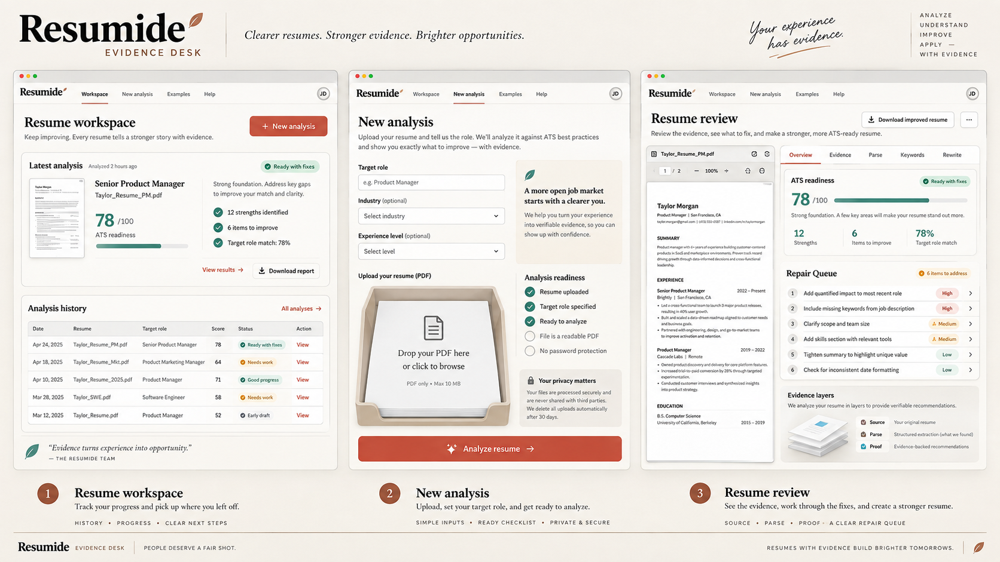
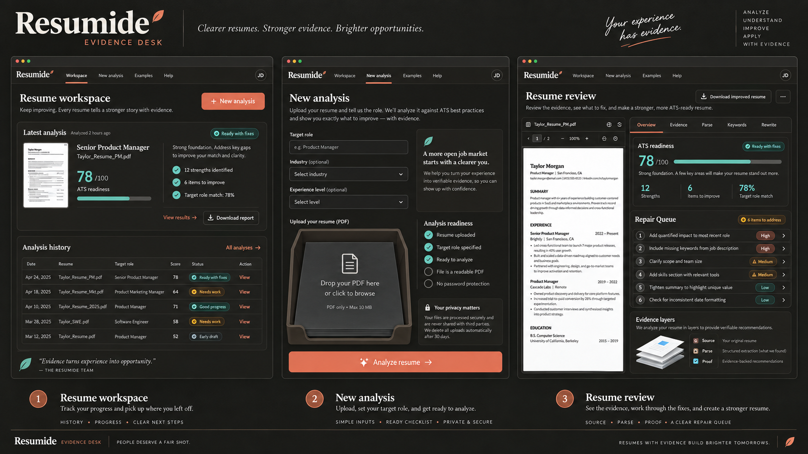

# Resumide Evidence Desk Product Design Blueprint

Status: **DESIGN IMPLEMENTED ACROSS ALL ROUTED SURFACES; AUTHENTICATED DATA FIXTURE REVIEW PENDING**
Direction: Editorial Intelligence + Precision Evidence + tactile document interactions
Inputs: [`DESIGN.md`](../../DESIGN.md), [`DESIGN_CONCEPTS.md`](../../DESIGN_CONCEPTS.md), and [`COMPETITIVE_UX_RESEARCH.md`](COMPETITIVE_UX_RESEARCH.md)

Implementation note, 2026-09-10: the public page, authentication, analysis workspace, Upload, Progress, Result and every result tab, Privacy, and recovery surfaces now use the Evidence Desk structure. Document motion is CSS-only and reduced-motion-safe. Public and signed-out flows pass desktop, mobile, light, dark, and axe checks. A seeded authenticated visual-regression fixture is still required to capture real-data Workspace, Result, and Privacy screenshots.

## 1. Product identity

### Product role

Resumide is an ATS evidence and resume-repair workspace. It is not a resume-template marketplace, generic AI writing suite, or full job-application CRM in this phase.

### Product promise

> See what the ATS-like parser saw, understand what affected the score, and know what to improve first.

### Design name

**Evidence Desk**

The interface should feel like a calm expert reviewing a document at a precise analysis desk. The guidance layer is warm and editorial. The evidence layer is compact, technical, and auditable.

### Source preview and editor runway

The Result page treats the uploaded resume as the primary source of truth. The
source panel renders page one of the real PDF as an image preview, keeps the
original signed PDF available through **Open PDF**, and uses the evidence-stack
artwork only for loading or unavailable states. This boundary is intentional so
future editing can be introduced without replacing the analysis contract.

The future live editor should extend this panel rather than mutate it in place:

1. Keep the original PDF immutable and create a draft `resume_version` for each editing session.
2. Render a normalized document model with stable block IDs, page coordinates, and source text spans.
3. Anchor AI suggestions to those block IDs and evidence/rule IDs so every suggestion can be inspected, accepted, rejected, or undone.
4. Save accepted changes as a new version, re-run deterministic checks, and keep the original analysis as an audit trail.
5. Run PDF rendering in a worker, virtualize pages, lazy-load editor tools, and keep signed URLs short-lived so the live editor stays responsive and private.

The current `resumeUrl` and `imageUrl` boundary already supports this sequence:
the PDF remains the source, the page image is a derived preview, and the result
tabs remain read-only until an explicit editor mode is introduced.

### Signature model

**Evidence Stack**

```text
Source  ->  Parse  ->  Proof
PDF         extracted   scoring rules,
            structure   keywords, warnings
```

This model defines:

- the 3D document artifact;
- the upload explanation;
- the processing stages;
- the result navigation;
- the provenance shown for every important recommendation.

### Signature result

**Repair Queue**

The first result view contains a maximum of three high-impact tasks. Each task includes the issue, evidence, reason, and next action. Detailed scores and report sections follow this queue.

## 2. Visual concept boards

### Light mode



### Dark mode



The boards are directional mockups. Exact copy, data, navigation labels, and feature availability must follow the application contracts described below.

## 3. Experience architecture

### Primary journey

```text
Resume workspace
    -> New analysis
        -> Durable progress
            -> Repair Queue
                -> Evidence inspection
                    -> Copy safe rewrite
                        -> Re-analyze a new version
```

### Public route journey

```text
Product explanation -> See how scoring works -> Privacy -> Sign in / Analyze
```

### Signed-in route journey

```text
Analyses -> New analysis -> Progress -> Result -> New version
```

### Navigation model

Desktop signed-in workspace:

- 232px rail.
- Wordmark and workspace label at top.
- Analyses and New analysis as the first actions.
- Privacy and Account at the bottom.
- Current route uses a left evidence bar, not a filled pill.

Tablet:

- 72px icon rail.
- Accessible tooltips and visible selected state.
- Page title and action remain in the content header.

Mobile:

- 56px top bar with brand, theme, and account.
- Bottom navigation for Analyses, New analysis, and Account.
- New analysis is visually emphasized but remains part of the same navigation pattern.
- No essential action is hidden behind hover.

### Page frame

```text
Workspace shell
  Page header
    Eyebrow or context
    One h1
    One-sentence purpose or state
    Dominant action
  Page body
    Primary task region
    Supporting evidence or status region
  Optional sticky action bar
```

## 4. Design system grammar

### Surface hierarchy

| Level    | Purpose                     | Treatment                                             |
| -------- | --------------------------- | ----------------------------------------------------- |
| Canvas   | Route background            | Warm paper or graphite with a static low-opacity aura |
| Section  | Continuous content region   | Transparent or `surface`; dividers preferred          |
| Panel    | Bounded task area           | Opaque `surface-raised`, 1px border, 12px radius      |
| Floating | Navigation, toolbar, dialog | Bounded glass with opaque fallback                    |
| Document | PDF or Evidence Stack       | Paper surface, 18px outer frame, controlled shadow    |

### Buttons

**Primary**

- Coral, solid, no gradient.
- One per screen or clear task region.
- Minimum 44px height.
- Label starts with a verb: Analyze, View, Copy, Request.

**Secondary**

- Opaque surface with strong border.
- Used for Return, Open PDF, Replace, Retry.

**Quiet**

- Text and icon; background appears on hover/focus.
- Used for overflow and low-frequency navigation.

**Destructive**

- Danger text and border on neutral surface.
- Filled danger is reserved for the final confirmation.

**Button states**

- Default, hover, pressed, focus-visible, disabled, busy.
- Busy retains width, replaces the leading icon, and uses honest status copy.
- Disabled buttons explain readiness nearby rather than relying on color.

### Forms

- Labels remain above fields.
- Optional fields include `(optional)` in the label.
- Helper text appears below the control and before errors.
- Error text is concise, action-oriented, and associated with the field.
- Input surfaces are opaque in both themes.
- Long forms use fieldsets with visible legends.
- Consent is a separate privacy region, not a small checkbox buried in the form.

### Cards and rows

- Use a card only when the whole object is selectable, such as the latest analysis or a resume version.
- Use rows for history, rules, keyword groups, requests, and repair tasks.
- Use sections with dividers for continuous result content.
- Do not nest more than one panel inside another panel.

### Status language

| State type  | Label       | Meaning                                                |
| ----------- | ----------- | ------------------------------------------------------ |
| Verified    | Verified    | Direct parse evidence or deterministic rule output     |
| Suggested   | Suggested   | Qualitative AI language guidance                       |
| Partial     | Partial     | Some valid output exists; another stage is unavailable |
| Unavailable | Unavailable | No safe result can be shown for that region            |
| User state  | Resolved    | User marked a repair task complete                     |

### Iconography

- 1.75px rounded line icons.
- Icons supplement labels; they do not replace essential text on desktop.
- Check, warning, and failure each combine shape, icon, and label.
- The brand mark is a simple layered document or evidence leaf, not an AI sparkle.

## 5. Responsive grid

| Viewport  | Grid       | Gutters | Shell behavior                          |
| --------- | ---------- | ------- | --------------------------------------- |
| 320-767   | 4 columns  | 16px    | Top bar and bottom navigation           |
| 768-1023  | 8 columns  | 20px    | Compact rail or top navigation by route |
| 1024-1439 | 12 columns | 24px    | Full workspace rail and split panes     |
| 1440+     | 12 columns | 24px    | Content capped at 1440px                |

Primary breakpoints are verified at 390, 768, 1024, 1366, and 1440 pixels, plus a 320px no-horizontal-scroll check.

## 6. Page 1: Public product page

### Purpose

Explain the product before asking for a resume.

### Desktop structure

```text
Top navigation
Hero: product promise + Analyze CTA | interactive Evidence Stack preview
Trust strip: private, evidence-based, human-reviewed suggestions
How it works: Source -> Parse -> Proof
Result preview: PDF + Repair Queue
Scoring explanation: deterministic vs suggested output
Privacy summary
Final CTA
Footer
```

### Hero content

- H1: `See what the ATS sees.`
- Supporting line: `Inspect your parsed resume, understand every score, and fix the highest-impact issues first.`
- Primary action: `Analyze your resume`.
- Secondary action: `See how scoring works`.

### Unique visual

The Evidence Stack is the only large 3D visual. Hover or pointer movement can shift layers by no more than four degrees on capable desktop devices. Touch and reduced-motion users see a static stack.

### Mobile

- Copy first, action second, artifact third.
- No autoplay video.
- Evidence Stack fits within a fixed aspect-ratio region to prevent layout shift.

## 7. Page 2: Authentication `/auth`

### Purpose

Explain the benefit of authentication and complete magic-link sign-in with minimal friction.

### Desktop structure

```text
Public top bar
┌─────────────────────────────┬─────────────────────────────┐
│ Private analysis statement  │ Sign-in form                │
│ Static Evidence Stack       │ Email field                 │
│ Private history             │ Send secure link            │
│ Cross-device access         │ No password required        │
└─────────────────────────────┴─────────────────────────────┘
```

### States

- Default: email form.
- Submitting: button busy state; form remains stable.
- Success: replace form with Check your email panel.
- Invalid email: inline error plus summary.
- Expired link: resend, change email, return.
- Provider failure: safe message and Retry.

### Mobile

- Trust statement becomes a short strip above the form.
- The artifact is removed before any form content is pushed below the fold.

## 8. Page 3: Resume workspace `/`

### Purpose

Help a returning user continue useful work in less than five seconds.

### Desktop structure

```text
Workspace rail
Page header: Resume workspace                         [Analyze resume]
Latest analysis: target, status, score, three facts   [View result]
History toolbar: label, optional search/filter
Analysis rows: resume | target | state | score | updated | action
Pagination
```

### Latest analysis

- One selectable panel.
- Displays target role, resume filename, score band, number of strengths, number of repairs, and update time.
- Primary row action is View result or Continue based on status.
- No full-page PDF thumbnail conversion.

### History row

- Minimum 56px height desktop, 68px mobile.
- Entire row may be selectable if overflow actions remain separate.
- Status is text plus icon.
- Score uses tabular numbers.
- Mobile row: filename and target on the first two lines; status, score, and date in a metadata row.

### States

- Empty: compact Evidence Stack, promise, Analyze resume.
- Loading: 4 row skeletons with fixed dimensions.
- Error: shell stays available; Retry and New analysis remain visible.
- Page transition: retain prior rows until the next page resolves.

## 9. Page 4: New analysis `/upload`

### Purpose

Make the file, target context, privacy boundary, and readiness state clear before submission.

### Desktop layout

```text
Page header: New analysis                     Step 1 of 2
7 columns                                   5 columns
Target role fieldset                        Analysis readiness
Resume PDF paper tray                       Real validation checks
AI consent and privacy                      What happens next
Sticky footer: file state + next step       [Analyze resume]
```

### Section A: Target role

- Job title, optional.
- Job description, optional.
- Explain that role context enables keyword and relevance analysis.
- Character counts appear only near the limit.

### Section B: Resume PDF

- Paper-tray dropzone with click/tap browse alternative.
- Empty, drag-active, selected, rejected, oversized, encrypted, scanned, and removed states.
- Selected state shows filename, size, type, Replace, and Remove.
- Drag-active raises the top document by 4px and turns the evidence border teal.

### Section C: AI consent

- Plain-language title: `AI-assisted feedback`.
- Explain what text is sent, why, and what happens if the optional stage is unavailable.
- Link to Privacy.
- Consent remains explicit and unchecked.

### Readiness panel

- PDF selected.
- File signature and type valid.
- Size under the configured limit.
- Text-readable status is shown only after known.
- Job context present or explicitly marked optional.
- Consent accepted.

### Sticky action bar

- Left: `Ready to analyze resume.pdf` or the single next requirement.
- Right: Analyze resume.
- On mobile, it becomes a bottom action region above mobile navigation.

### Processing transition

After acceptance, navigate to the durable Progress route. Do not replace the form with a large GIF. A brief upload acknowledgement may appear for less than 360ms if reduced motion is not enabled.

## 10. Page 5: Analysis progress `/analysis/:id`

### Purpose

Reduce uncertainty while preserving control and truthful status.

### Desktop layout

```text
Page header: Analyzing your resume                       [Cancel]
5 columns                              7 columns
Document scan artifact                 Six-stage timeline
Source / Parse / Proof labels          Last update and durable message
                                       State-specific recovery
```

### Timeline

1. Secure upload.
2. Extract text.
3. Parse structure.
4. Score evidence.
5. Generate feedback.
6. Save result.

Each item has label, short explanation, and timestamp when available. Completed stages are static. The current stage has a subtle scan-line motion and `aria-current="step"`.

### Durable message

Show `You can safely leave this page. Your analysis will continue.` only after persistence confirms that promise.

### Terminal states

- Completed: result summary and View result.
- Partial: explain that deterministic evidence is ready and qualitative feedback is unavailable.
- Failed: state whether the upload is retained and offer Upload again.
- Cancelled: show when processing stopped and offer Start another analysis.
- Rejected: show the violated input boundary and how to correct it.
- Needs OCR: explain text-layer requirements without blaming the user.

### Mobile

- Timeline appears first.
- Static compact artifact appears second or is omitted on constrained height.
- Cancel stays in the page header while valid.

## 11. Page 6: Resume result `/resume/:id`

### Purpose

Convert analysis into the smallest useful set of evidence-backed actions.

### Desktop layout

```text
Page header: Resume review / target / saved state       [New analysis]
5-column sticky viewer             7-column analysis workspace
PDF toolbar                        Sticky result tabs
Source document                    Score meaning
Parse overlay toggle               Repair Queue
Open PDF                           Current section
```

### Sticky tabs

- Overview.
- ATS Evidence.
- Parse View.
- Keywords.
- Rewrite.

Tabs use bounded glass only while sticky. URL hashes preserve the selected section for deep linking.

### Overview

Order:

1. Overall score, written band, and limitations.
2. Repair Queue with no more than three initial actions.
3. Category breakdown: ATS, Tone and Style, Content, Structure, Skills.
4. Strengths worth preserving.

The score is not a giant isolated gauge. It is one part of the result header and always includes a written explanation.

### ATS Evidence

Each evidence row includes:

- rule label and stable ID;
- Pass, Needs attention, or Skipped;
- weight and effect;
- direct evidence excerpt when available;
- remediation;
- link to source or parse location.

Group rows by Searchability, Structure, Content, and Job relevance. Accordions may collapse groups but default to the highest-priority failing group.

### Parse View

- Viewer and extracted data remain side by side.
- Contact details, sections, dates, bullets, and warnings are distinct regions.
- Selecting a parsed section highlights the source area when location data supports it.
- Always state that this is an ATS-like simulation, not a proprietary vendor's exact parser.

### Keywords

- Page title is `Keyword coverage`, not Heatmap.
- Summary: matched count, missing count, and coverage percentage.
- Groups: Required skills, Responsibilities, Tools, Domain language.
- Matched and missing tokens include text labels and icons.
- Empty state asks the user to re-analyze with job context.
- Never encourage adding a skill the user does not have.

### Rewrite

- Original text on the left or top.
- Suggested text on the right or below.
- Reasoning and evidence grounding below both.
- Current capability: Copy suggestion.
- Future capability: Accept and Undo only after persistent versioning exists.
- Every item says `Review for accuracy before use.`

### Mobile

- Analysis content is the default view.
- A Preview button opens the PDF in a full-screen sheet.
- Result tabs are horizontally scrollable with visible edge affordance and keyboard support.
- Repair Queue stays above the fold.
- No sticky 100vh PDF pane.

## 12. Page 7: Privacy `/privacy`

### Purpose

Make retention and user control understandable before a sensitive action.

### Structure

```text
Page header: Privacy and data
Retention summary
Export data row                                  [Request export]
Delete account row                               [Review deletion]
Request history
```

### Export row

- Explains included data.
- Shows delivery expectations only if supported by policy.
- Uses a secondary action.

### Deletion row

- Isolated by spacing and a danger border.
- Lists the scope and recovery limits.
- Opens a confirmation dialog.
- Backend re-authentication remains a separate implementation requirement before stronger claims are made.

### Request history

- Kind, status, submitted date, completion date, and request ID.
- Empty state: `No privacy requests yet.`
- Processing state includes a static timeline, not an indefinite spinner.

## 13. Page 8: Error, not found, and expired session

### Shared structure

```text
Normal shell
State label
Plain-language h1
What happened
What data is safe
Request ID when available
Primary recovery
Secondary navigation
```

### Examples

- 404: `We could not find that analysis.` Return to analyses.
- 202 direct result: `This analysis is still running.` View progress.
- 401/expired: `Your session expired. Your saved analysis is still private.` Sign in again.
- 500: `We could not load this result.` Retry and provide request ID.

Production never shows raw stack output.

## 14. Motion design

### Route entrance

- 240 to 360ms opacity plus 8px vertical transform.
- Run once after navigation, not after every data update.

### Buttons and rows

- Hover: 100ms color or surface change.
- Press: 80ms translateY(1px).
- Selected row: 140ms evidence-border transition.

### Evidence Stack

- Source, Parse, and Proof layers separate by 6 to 10px in depth.
- Desktop pointer tilt is capped at four degrees.
- Use `requestAnimationFrame` and stop while offscreen or hidden.
- Static fallback is visually complete.

### Scan artifact

- One line moves down the document while a processing stage is active.
- Stage changes reset the scan once.
- No looping glow, particle system, or fake completion percentage.

### Reduced motion

- Remove parallax, scan travel, stagger, and perspective transitions.
- State labels and stage changes remain visible immediately.

## 15. Light and dark behavior

Both themes share hierarchy but not literal elevation values.

Light mode:

- Canvas carries a faint coral and teal aura.
- Panels use warm whites and low-contrast borders.
- Document shadows may be visible.

Dark mode:

- Canvas is warm graphite, not pure black.
- Panels separate through borders and small lightness shifts.
- Shadows are nearly removed.
- PDF pages remain white paper so the artifact stays honest.
- Coral and teal use their lighter theme values for contrast.

No component branches on hard-coded light or dark utility colors after migration.

## 16. Accessibility contract

- One `h1` per route.
- Skip link targets the primary content.
- Navigation, main, aside, section, and footer landmarks have clear labels.
- All touch targets are at least 44 by 44px.
- Theme, tabs, dialogs, accordions, and file upload expose correct name, role, value, and state.
- Dragging is optional; Browse performs the same upload action.
- Status changes use restrained live regions.
- Score and status never rely on color alone.
- Focus stays visible in both themes.
- 200 percent zoom does not hide content or create two-dimensional scrolling for normal page regions.

## 17. Performance contract

- No Three.js in the first redesign.
- No global motion runtime for CSS-capable transitions.
- LCP at or below 2.5 seconds at p75.
- INP at or below 200ms at p75.
- CLS at or below 0.1 at p75.
- Initial route JavaScript under 170KB compressed, excluding route-lazy PDF tooling.
- PDF conversion loads only on routes that need it.
- Decorative visuals use fixed dimensions.
- First useful content does not wait for animation, PDF rendering, or AI.
- Polling and animation pause in hidden tabs.

## 18. Component delivery map

### Foundation slice

- `PublicShell`.
- `WorkspaceShell`.
- `WorkspaceRail`.
- `MobileNavigation`.
- `PageHeader`.
- `Button` and `IconButton`.
- `Field`, `Textarea`, and `Checkbox`.
- `StatusBadge`.
- `Panel`, `Section`, and `DataRow`.

### Critical-journey slice

- `FileDropzone`.
- `AnalysisReadiness`.
- `DocumentArtifact`.
- `StageTimeline`.
- `AnalysisStatePanel`.
- `ResumeViewer`.
- `ResultTabs`.
- `RepairQueue`.

### Evidence slice

- `ScoreSummary`.
- `ScoreBreakdown`.
- `EvidenceRow`.
- `ParseComparison`.
- `KeywordCoverage`.
- `RewriteDiff`.

### System-state slice

- `Skeleton`.
- `EmptyState`.
- `ErrorState`.
- `Dialog`.
- `Toast` only for non-blocking confirmations.

## 19. Implementation gates

### Gate D1: Structure review

- Approve the eight page structures in this blueprint.
- Approve the Evidence Stack and Repair Queue.
- Approve analysis-first scope.
- Progress: **COMPLETE**.

### Gate D2: Static critical screens

- Produce exact desktop and mobile frames for Upload, Progress, and Result.
- Cover light and dark.
- Cover default, busy, error, success, and partial states.

### Gate D3: Component grammar

- Implement and test foundation primitives in isolation.
- Verify keyboard, contrast, responsive behavior, and reduced motion.
- Progress: **COMPLETE** for the implemented routed surfaces.

### Gate D4: Critical journey

- Implement Upload, Progress, and Result without changing server contracts.
- Verify direct-open, refresh, cancellation, partial result, and failure recovery.
- Progress: **IMPLEMENTED**. Upload and Progress are browser-checked; Result is type-, build-, and component-checked. Seeded authenticated visual capture remains a verification task, not a design implementation task.

### Gate D5: Supporting pages

- Implement Home, Authentication, Privacy, Error, and Not found.
- Progress: **COMPLETE**.

### Gate D6: Motion and production hardening

- Enable measured CSS/SVG motion.
- Run visual regression, axe, browser, zoom, theme, bundle, and Core Web Vitals gates.
- Progress: **PARTIAL VERIFICATION**. CSS-only motion, responsive routes, production build, lint, unit tests, and axe pass. Seeded visual regression and field Core Web Vitals measurement remain.

## 20. Out of scope for this redesign

- Full job Kanban tracker.
- Contacts, interview tracking, email automation, or job discovery.
- Enterprise administration.
- Billing UI before entitlement decisions.
- WebGL scenes.
- Automated claims that a resume will pass a specific proprietary ATS.
- Accept and Undo rewriting before durable resume versioning supports it.

## 21. Final design decision

The Resumide redesign uses:

```text
System name        Evidence Desk
Visual direction   Editorial Intelligence + Precision Evidence
3D metaphor        Evidence Stack: Source -> Parse -> Proof
Result model       Repair Queue -> detailed evidence tabs
Product scope      Analysis-first resume workspace
Themes             Purpose-built light and dark
Implementation     Static critical frames before production route changes
```
